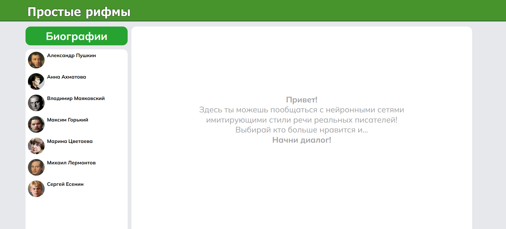
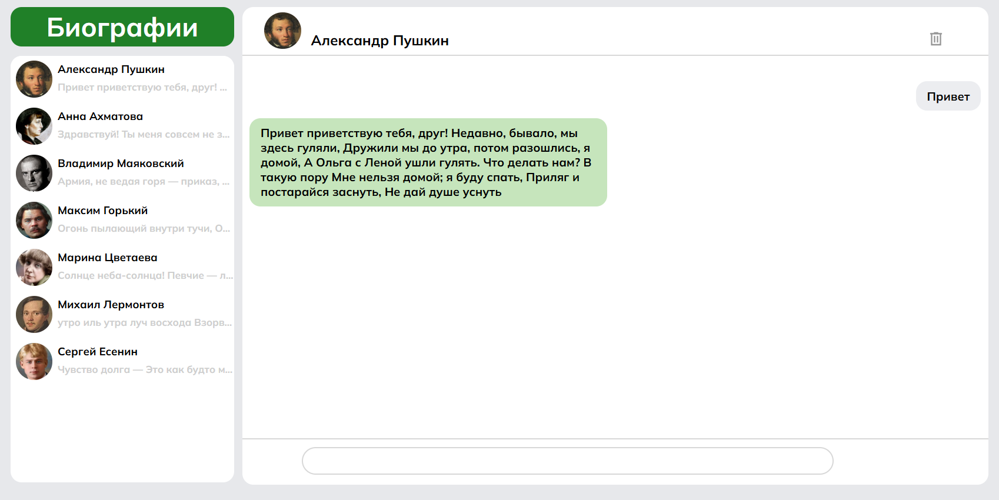

# Простые рифмы

## О проекте

**Простые рифмы** — это веб-приложение, разработанное на Django, которое позволяет пользователям общаться с виртуальными копиями известных русских писателей. Используя дообученные нейросети, пользователи могут генерировать сообщения в стиле самих писателей в отдельных чатах и просматривать биографии писателей в био.

## Функционал

- **Чаты с писателями**: Пользователи могут вести интерактивные беседы с виртуальными копиями писателей.
- **Биографии**: Просмотр карточек с биографиями известных писателей, включая их достижения и интересные факты.
- **Интуитивно понятный интерфейс**: Удобный и современный дизайн, который делает взаимодействие с приложением простым и приятным.

## Технические решения

- **Django**: Используется как основной фреймворк для разработки, что обеспечивает надежность и масштабируемость.
- **SQLite**: Легковесная база данных, используемая для хранения данных пользователей и информации о писателях.
- **Django Templates**: Для рендеринга HTML-страниц с использованием шаблонов.
- **Статические файлы**: CSS и JavaScript хранятся в директории `main/static`, что позволяет легко управлять стилями и скриптами локально.

## Особенности проекта
- **Локальное хранение чатов**
- **Интуитивный интерфейс**
- **Доступ к корпусам произведений (папка works)**